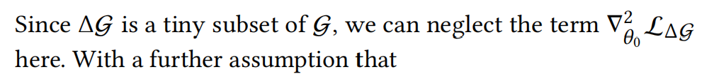

1. Traditional Influence Functions approximation:
   $$\hat{\theta} - \theta_0 \approx H_{\theta_0}^{-1}\nabla_{\theta_0} \mathcal{L}_{\Delta G}$$

   1. ==Loss function on original training set:==
      $$\mathcal{L}_0 = \sum_{z_i \in \mathcal{D}_0} l \left( f_{G}(z_i), y_i \right)$$

   2. Hessian matrix definition:
      $$H_{\theta_0} = \sum_{z_i \in \mathcal{D}_0} \nabla_{\theta_0}^2 l \left( f_{G}(z_i), y_i \right)$$

   3. ==Final loss after unlearning:==
   
      (its prediction from $f_G and f_{G\setminus \Delta G}$ are identical. )
   
      $$\hat{\theta} = \arg\min_{\theta} \mathcal{L}, \quad \mathcal{L} =\sum_{z_i \in \mathcal{D}_0 \setminus \Delta D} l \left( f_{G \setminus \Delta G}(z_i), y_i \right) = \sum _{z_i\in D_0}l \left( f_{G }(z_i), y_i \right) - \sum_{z_i\in\Delta D} l \left( f_{G }(z_i), y_i \right) $$

   4. Perturbed parameter optimization:
      $$\theta_\epsilon = \arg\min_{\theta} (\mathcal{L}_0 + \epsilon \mathcal{L}_{\Delta G})$$

   5. First-order optimality conditions:(两个高亮的损失函数，在极小值点梯度为0)
      $$0 = \nabla_{\theta_\epsilon} \mathcal{L}_0 + \epsilon \nabla_{\theta_\epsilon} \mathcal{L}_{\Delta G}, \quad 0 = \nabla_{\theta_0} \mathcal{L}_0$$

   6. Taylor expansion approximation:（在$\theta_0$处展开，展开到一阶）
      $$0 \approx \left( \epsilon \nabla_{\theta_0} \mathcal{L}_{\Delta G} + \nabla_{\theta_0} \mathcal{L}_0 \right) + \Delta \theta \left( \nabla_{\theta_0}^2 \mathcal{L}_0 + \epsilon \nabla_{\theta_0}^2 \mathcal{L}_{\Delta G} \right) $$

      

   7. Loss under $\epsilon = -1$:
      $$\mathcal{L} = \mathcal{L}_0 - \mathcal{L}_{\Delta G}$$
   
   8. Final parameter change estimation:
   
      $\nabla_{\theta_0}^2\mathcal L_{\Delta G} $ 可忽略
   
      $$\hat{\theta} - \theta_0 = \theta_{\epsilon=-1}  - \theta_0 \approx - H_{\theta_0}^{-1}\nabla_{\theta_0} \mathcal{L}_{\Delta G}$$
   
2. **问题**：图数据中节点通过边连接，删除一个节点会影响其多跳邻居的表示。传统方法忽略了这种**结构性依赖**，导致未完全消除目标数据的影响。（The perturbation in one sample will not affect the state of other samples.）

   1. 核心在于$\Delta \mathcal L$的优化

      $\mathcal L_0-\mathcal L =  \sum_{z_i \in \mathcal{D}_0} l \left( f_{\mathcal G}(z_i), y_i \right) - \sum_{z_i \in \mathcal{D}_0 \setminus \Delta D} l \left( f_{\mathcal G \setminus \Delta\mathcal G}(z_i), y_i \right) $

      根据图进行拓展：taking graph dependencies into consideration.
      $$
      \hat{\theta}_\epsilon = \arg \min_{\theta} \left( \mathcal{L}_0 + \epsilon \Delta \mathcal{L}_{(\mathcal G \setminus \Delta \mathcal G)} \right), \quad \Delta \mathcal{L}_{(\mathcal G \setminus \Delta \mathcal G)} = \sum_{z_i \in \mathcal{D}} \hat l(z_i, y_i),\\
      \hat l(z_i, y_i) =
      \begin{cases}
      l(f_\mathcal G(z_i), y_i), & z_i \in \Delta \mathcal G \\
      l(f_{\mathcal G}(z_i), y_i) - l(f_{\mathcal G \setminus \Delta\mathcal G}(z_i), y_i), & z_i \text{ is influenced by } \Delta \mathcal G \\
      0, & \text{other nodes}
      \end{cases}
      \tag{14}
      $$
      Graph-oriented Influence Functions:

      + $\hat\theta-\theta_0 \approx H^{-1}_{\theta_0}\Delta\mathcal L_{G\setminus \Delta G}$

      + define of k-pop neighbors

        $\mathcal N_k(z_i) = \{z_j \mid 1 \leq \text{SPD}(z_j, z_i) \leq k\},$(shortest path distance)

        $\mathcal N_k(e_i) = N_k(z_1') \bigcup N_k(z_2') \bigcup \{z_1', z_2'\},$
        $$
        \Delta\theta = H^{-1}_{\theta_{0}} \sum_{z_{i} \in \mathcal{N}_{k}\left(\mathcal{V}^{(rm)}\right) \cup \mathcal{V}^{(rm)}} \nabla_{\theta_{0}} l\left(f_{\mathcal{G}}(z_{i}), y_{i}\right) 
        - H^{-1}_{\theta_{0}} \sum_{z_{i} \in \mathcal{N}_{k}\left(\mathcal{V}^{(rm)}\right)} \nabla_{\theta_{0}} l\left(f_{\mathcal{G}}(z_{i}; \mathcal{G} \setminus \Delta\mathcal{G}), y_{i}\right)
        $$
      
        $$
        考虑a对b的影响，若ab是邻居，则\mathcal V^{rm}=b,则若删除a节点，\\
        \Delta\theta = H^{-1}_{\theta_{0}} \sum_{z_{i} \in \mathcal N_k \left(\mathcal a \right) \cup \mathcal a} \nabla_{\theta_{0}} l\left(f_{\mathcal{G}}(z_{i}), y_{i}\right) 
        - H^{-1}_{\theta_{0}} \sum_{z_{i} \in \mathcal{N}_{k}\left(\mathcal a \right)} \nabla_{\theta_{0}} l\left(f_{\mathcal{G}}(z_{i}; \mathcal{G} \setminus \Delta\mathcal{G}), y_{i}\right)\\
        h_b=f_{\mathcal G\setminus a}(b)|_{\hat \theta_a}\\
        相应地,h_a=f_{\mathcal G\setminus b}(b)|_{\hat \theta_b}\\
        $$
      
        
      
      + edge
        $$
        \Delta\theta = H^{-1}_{\theta_{0}} \sum_{z_{i} \in \mathcal{N}_{k}(\mathcal{E}^{(rm)})} \nabla_{\theta_{0}} l\left(f_{\mathcal{G}}(z_{i}), y_{i}\right) 
        - H^{-1}_{\theta_{0}} \sum_{z_{i} \in \mathcal{N}_{k}(\mathcal{E}^{(rm)})} \nabla_{\theta_{0}} l\left(f_{\mathcal{G}}(z_{i}; \mathcal{G} \setminus \Delta\mathcal{G}), y_{i}\right)
        $$
        
      + feature
        
        $z_i \sim \chi^{(rm)}$ indicates that the feature of node $z_i$ is revoked
        $$
        \Delta\theta = H^{-1}_{\theta_{0}} \sum_{z_{i} \sim \mathcal{N}_{k}(\mathcal{X}^{(rm)}) \cup \mathcal{X}^{(rm)}} \nabla_{\theta_{0}} l\left(f_{\mathcal{G}}(z_{i}), y_{i}\right) 
        - H^{-1}_{\theta_{0}} \sum_{z_{i} \sim \mathcal{N}_{k}(\mathcal{X}^{(rm)}) \cup \mathcal{X}^{(rm)}} \nabla_{\theta_{0}} l\left(f_{\mathcal{G}}(z_{i}; \mathcal{G} \setminus \Delta\mathcal{G}), y_{i}\right)  
        $$
        
      
      相似的形式： $\Delta \mathcal L_{G\setminus\nabla G}= \sum_{z_i\in受影响的区域}[l(f_{G}(z_i),y_i)-l(f_{G\setminus \Delta G}(z_i),y_i)]$
      
      $\Delta\theta = H_{\theta_0}^{-1}(\sum_{z_i\in 目标节点（边，特征）+邻居}\nabla_{\theta_0}l(f_{G}(z_i),y_i)-\sum_{z_i\in 邻居}\nabla l(f_{G\setminus \Delta G}(z_i),y_i))$

### F1分数

F1 score 是精确率（Precision）和召回率（Recall）的调和平均数

+ precision

  精确率是指被模型预测为正类的样本中实际为正类的比例。用公式表示为：

  Precision = TP / (TP + FP)

+ recall

​		召回率是指实际为正类的样本中被模型正确预测为正类的比例。公式为：

​		Recall = TP / (TP + FN)

​		

<figure><figcaption align="left">**Table 1** Different runs' result</figcaption></figure>

|                         | Run 0  | Run 1  | Run 2  | Run 3  | Run 4  | Run 5  | Run 6  | Run 7  | Run 8  | Run 9  |
| :---------------------- | :----- | :----- | :----- | :----- | :----- | :----- | :----- | :----- | :----- | :----- |
| **Test F1**             | 0.8339 | 0.8524 | 0.8266 | 0.8487 | 0.8524 | 0.8450 | 0.8450 | 0.8339 | 0.8598 | 0.8376 |
| **Training Time (s)**   | 6.3709 | 6.3226 | 5.9766 | 6.1177 | 6.3600 | 6.7334 | 6.4672 | 6.7090 | 6.2913 | 7.1234 |
| **Evaluation Time (s)** | 0.0480 | 0.0400 | 0.0480 | 0.0531 | 0.0460 | 0.0465 | 0.0475 | 0.0467 | 0.0410 | 0.0412 |

### 总体实验结果

|         指标          | 值             |
| :-------------------: | :------------- |
|      F1分数均值       | 0.8417         |
|     F1分数标准差      | 0.0110         |
|   平均模型训练时间    | 6.3401 seconds |
| 平均GIF单轮反训练时间 | 0.1676 seconds |

| 运行编号 | 训练时间 (秒) | 测试 F1 分数 | 测试准确率 | 测试召回率 | 测试精确率 |
| :------- | :------------ | :----------- | :--------- | :--------- | :--------- |
| 0        | 6.549         | 0.8339       | 0.8339     | 0.8339     | 0.8339     |
| 1        | 6.336         | 0.8303       | 0.8303     | 0.8303     | 0.8303     |
| 2        | 6.471         | 0.8450       | 0.8450     | 0.8450     | 0.8450     |

| 指标                    | 平均值 | 标准差 |
| :---------------------- | :----- | :----- |
| F1 分数                 | 0.8364 | 0.0063 |
| 准确率                  | 0.8364 | 0.0063 |
| 召回率                  | 0.8364 | 0.0063 |
| 精确率                  | 0.8364 | 0.0063 |
| 模型训练时间 (秒)       | 6.452  | -      |
| GIF F1 分数             | 0.8290 | 0.0046 |
| GIF 准确率              | 0.8413 | 0.0030 |
| GIF 召回率              | 0.8413 | 0.0030 |
| GIF 精确率              | 0.8413 | 0.0030 |
| GIF unlearning时间 (秒) | 0.2236 | -      |
